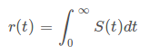

= CSC412 Computer Networks
Kelly Lu

== Computer Networks

The [.blue]*Internet* is a computer network that interconnects computing devices: [.blue]*hosts / end systems*

Hosts are divided into two categories:
1. Clients (users) +
2. Servers (distributors)

A network transfers data from one host to another host via a medium.

* [.blue]*Electromagnetic waves* require [.underline]#time varying signal# energy +

  electricity --> magnetism --> electricity

Laptops / computers have an omni-directional antenna (*Network Card*) that converts between digital and electromagnetic waves.

Hosts access the Internet through [.blue]*Internet Service Providers (ISPS)* which in itself a network of packet switches and communication links

Signals travel in a straight line whereas wires bend.
[.underline]#Reflection# allows the electromagnetic signal to bend in the wire.

Signal strength at a distance r from source is about `1 / r^2^`. If too far away, signal will be repeated.

[.blue]*Analog* Communications:  V(t) (velocity of propagation w.r.t time) occupies a continuous value, `V(t) = (0, V_max)`

Computer Communications is digital in binary (0s and 1s)

  Digital <------network card------> E.M.

== Modulation

=== Data Representation

Data is represented as a time-varying signal (S~t~(t)).

image:./images/image3.jpg[image3, 500, 200]

Upper limit = line capacity = bandwidth limited medium

`S~f~(t) = A~f~ * sin(2 * pi * f * t + theta~f~)`

[.blue]*Time-varying Signal* is the summation of all frequency components

//stem:[r(t) = int_0^oo S_f(t) dt]

=== What is Modulation?

In radio communication, a radio signal is "modulated" so that it can be transmitted over long distances.
In other words, the radio signal (input signal) is added with a carrier signal.

`Modulated Signal = S(t) * S~c~(t)`

A [.blue]*carrier signal* has a constant amplitude and frequency.

`S~c~(t) = A~c~ * sin(2 * pi * f~c~ + theta~c~)` +
`f~c~ >> f~m~`

A radio signal usually has a very low frequency.

Analog modulation comes in 3 types: +
1. Amplitude Modulation (AM) +
2. Frequency Modulation (FM) +
3. Phase Modulation

image:./images/image5.jpg[image5, 500, 280]

Noise `n(t)` adds onto the signal received and therefore there are peak detectors at the receiver.

`S(t) * S~c~(t) + n(t)`

=== Amplitude Modulation
The amplitude of S~c~(t) is modified as per S(t).

image:./images/image6.jpg[image6]

The amplitude of the carrier wave is modified proportionally according to the input signal.

* When the input signal has a low amplitude, the amplitude of the carrier wave is decreased and vice-versa.

=== Frequency Modulation
The frequency of S~c~(t) is modified as per S(t).

image:./images/image7.jpg[image7]

The frequency of the carrier wave is modified proportionally according to the amplitude of the input signal.

NOTE: FM has a better transmission quality than AM.

== Circuit Switching

=== Packet Switch

In packet switched networks, resources are _not reserved_!

* A session's messages use the resources on demand and as a consequence may have to wait (queue) for access to a communication link.

=== Circuit Switch

In circuit switched network, the resources needed along a path (buffer, link transmission rate) to provide for communication
between the end systems are _reserved_ for the duration of the communication session between the end systems.

[.underline]#Example:# +
Traditional telephone networks must establish a connection between the sender and the receiver (_bona fide_ connection) and maintain the
connection state for the duration of the call. This connection is a *circuit*. +
When the network establishes the circuit, it also reserves a constant transmission rate in the network's links.

== Multiplexing

A circuit in a link is implemented with either: +
1. Frequency-division multiplexing (FDM) +
2. Time-division multiplexing (TDM)

image:./images/image8.png[image8]

=== Frequency-Division Multiplexing (FDM)

The frequency spectrum of a link is divided up among the connections established across the link.

The link dedicated a frequency band to each connection for the duration of the connection.

The width of the band is called *bandwidth*.

* FM radio stations use FDM to share the frequency spectrum between 88 MHz and 108 MHz with each station being allocated a specific
frequency band.

=== Time-Division Multiplexing (TDM)

Time is divided into frames of fixed duration, and each frame is divided into a fixed # of time slots.

When the network establishes connection across the link, the network dedicates one time slot in every frame
to this connection to transmit the connection's data.

== Layers of Abstraction

.Seven-Layer ISO OSI Reference Model
|===
|Application
|Presentation
|Session
|Transport
|Network
|Data Link
|Physical
|===

[.underline]#Presentation:# doest not alter content but interpret

[.underline]#Session:# set up context for communication

[.underline]#Transport:# deliver content

[.underline]#Link:# transport interface
