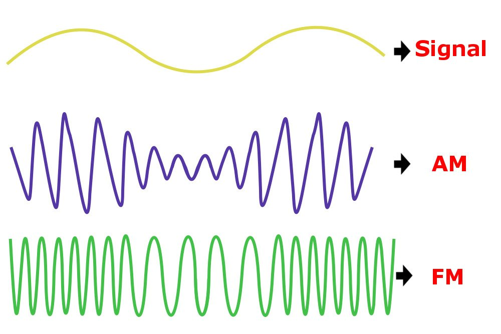

= CSC412 Computer Networks
Kelly Lu
:toc: left

Study Sheet

== Computer Networks

The [.blue]*Internet* is a computer network that interconnects computing devices: [.blue]*hosts / end systems*

Hosts are divided into two categories:
1. Clients (users) +
2. Servers (distributors)

A network transfers data from one host to another host via a medium.

* [.blue]*Electromagnetic waves* require [.underline]#time varying signal# energy +

  electricity --> magnetism --> electricity

Hosts are connected together by a network of *communication links* and *packet switches*.

.Communication Links
* Made up of different types of physical media:
** Coaxial cable
** Copper Wire
** Optical Fiber
** Radio spectrum
* Different Links transmit data at different rates (*Transmission Rate (bits / sec)*)

A computer sends a collection of bits ([.blue]*Packets*: an encapsulation of data).
*Packet Switches* forward packets to its outgoing communication links towards its destination host.

Laptops / computers have an omni-directional antenna (*Network Card*) that converts between digital and electromagnetic waves.

Hosts access the Internet through [.blue]*Internet Service Providers (ISPS)* which in itself a network of packet switches and communication links

== Physics of Electromagnetic Signal Transmissions

[.left.text-center]

v: velocity (electromagnetic) propagation +
T_prop: signal propagation delay time +
l: length of medium

`T~prop~ = l / v`

====
Given a wire 8,000 miles long traveling at a speed of 180,000 miles/sec. What is the propagation time?

`T~prop~ = 8,000 miles / 180,000 miles/sec` +
`= 2 / 45 sec = 0.044 sec = 44 ms`
====

Signals travel in a straight line whereas wires bend.
[.underline]#Reflection# allows the electromagnetic signal to bend in the wire.

Signal strength at a distance r from source is about `1 / r^2^`. If too far away, signal will be repeated.

[.blue]*Analog* Communications:  V(t) (velocity of propagation w.r.t time) occupies a continuous value, `V(t) = (0, V_max)`

Computer Communications is digital in binary (0s and 1s)

  Digital <------network card------> E.M.

== Information & Data Packets

When one host has data to send to another host--sender segments the data and adds header bytes to each segment ([.blue]*Packets*)
which are then sent through the network to the receiver where they are reassembled into the original data.

=== Packetization

[%header, cols=4*]
|===
|Preamble
|Header
|Data
|Trailer
|===

A [.underline]*preamble* is a fixed bit string that proceeds a data transmission.
The receiver's clock runs the preamble until alerted of an incoming packet.
Used to sync clocks.

A [.underline]*header* describes the content of the packet.
Can include: length of information and destination.

A [.underline]*trailer* signifies the end of the packet. Has to be a unique pattern.

==== Bit Stuffing
When a sequence of consecutive 1s appear in the data, insert a dummy 0 bit in the bit sequence.
The added 0s are removed at the reciever.

==== Checksum
packet =
[%header, cols=4*]
|===
|Preamble
|Header
|Data
|Checksum
|Trailer
|===

x = data bits sent

Create/compute a polynomial and use it as a checksum.

Suppose receiver receives a bit stream `y`. Receiver computes `delta(y)`.
....
if delta(y) == checksum received,
        accept y as the data
if checksum == corrupted,
        discard packet
....

=== Packet Switches
* Takes a packet arriving from one of its incoming communication links and forwards that packet on one of its outgoing communication links.
* Types:
** Routers (Network Core)
** Link-layer Switches (Access Networks)

=== Data Transmission

Packets are transmitted over each communication link at a rate equal to the full transmission rate of the link.
Therefore the time to transmit a packet of size `L bits` with a [.blue]*transmission rate* of `c bits/sec` is equal to `L/c seconds`

`(Transmission Time) = (size of packet) / (Transmission Rate or Clock Rate)` +
`T = L / c` +
`sec = bits / (bits/sec)`

=== Manchester Encoding (Preamble & Clock Synchronization)
.How are packets encoded and decoded?
Use clock to encode the data -> Use clock to decode the data

NOTE: The clocks on both computers have to be synchronized.

.How to synchronize clocks
Use a [.blue]*Preamble* before every packet. A preamble is a bit string that proceeds a data transmission (FIXED).
The receiver's clock runs the preamble until alerted of an incoming packet. The two then begin to synchronize.
By the time the actual data stream comes in, the two clocks would be synced.

Ethernet Preamble (8 bytes)::
* First 7 bytes: 10101010
** Wake up receiver & synchronize clocks
* Last byte: 10101011
** Last 2 bits alert receiver that the "important" data is about to come

=== Drift Rate

NOTE: Even when clocks are synced, they can begin to drift.

[.blue]*Drift* is the difference from the sender's rate from the target rate.

[.blue]*Drift Rate* is the difference in precision between the two clocks.

* Usually 10^-6^, 10^-7^, 10^-8^ for high precision clocks.
* bps^2^

Upper-bound on drift rate::
`drift rate = dc / dt |~max~`

.Worst Case Clock / Transmission Rate at Receivers
`c' = receiver's clock` # By clock we mean transmission rate +
`c = sender's clock`

`c' = c~0~ + (dc / dt) |~max~ * (L / c~0~)` +
`=> (Transmission Rate of Receiver) = (Transmission Rate of Sender) + (Drift Rate) * (Transmission Time of Sender)` +

(Transmission Time of Sender) = How long the clock can stay synchronized

(Drift Rate) * (Transmission Time of Sender) = (Transmission Rate of packet while still in sync)

.[.blue]*MAX Drift*

Max Drift (btwn Sender and Receiver): (sec)

`Ideal time = T~x~ = L / c` +
`Actual Time = T~x~ = L / c'` +
`delta = minimum overlap needed`

`|T~xi~ - T~xa~| < T - delta` +
`=> |(L/c) - (L / c')| < T - delta` # `T - delta` is the allowed drift

In terms of (1 / s):

`(c'/L) - (c / L) < delta - (1 / c)`

== Modulation

=== Data Representation

Data is represented as a time-varying signal (S~t~(t)).

Upper limit = line capacity = bandwidth limited medium

`S~f~(t) = A~f~ * sin(2 * pi * f * t + theta~f~)`

[.blue]*Time-varying Signal* is the summation of all frequency components

//stem:[r(t) = int_0^oo S_f(t) dt]
image:./images/image4.png[image4]

=== What is Modulation?

In radio communication, a radio signal is "modulated" so that it can be transmitted over long distances.
In other words, the radio signal (input signal) is added with a carrier signal.

`Modulated Signal = S(t) * S~c~(t)`

A [.blue]*carrier signal* has a constant amplitude and frequency.

`S~c~(t) = A~c~ * sin(2 * pi * f~c~ + theta~c~)` +
`f~c~ >> f~m~`

A radio signal usually has a very low frequency.

Analog modulation comes in 3 types: +
1. Amplitude Modulation (AM) +
2. Frequency Modulation (FM) +
3. Phase Modulation

Noise `n(t)` adds onto the signal received and therefore there are peak detectors at the receiver.

`S(t) * S~c~(t) + n(t)`

=== Amplitude Modulation
The amplitude of S~c~(t) is modified as per S(t).

The amplitude of the carrier wave is modified proportionally according to the input signal.

* When the input signal has a low amplitude, the amplitude of the carrier wave is decreased and vice-versa.

=== Frequency Modulation
The frequency of S~c~(t) is modified as per S(t).

The frequency of the carrier wave is modified proportionally according to the amplitude of the input signal.

NOTE: FM has a better transmission quality than AM.

== Circuit Switching

=== Packet Switch

In packet switched networks, resources are _not reserved_!

* A session's messages use the resources on demand and as a consequence may have to wait (queue) for access to a communication link.

=== Circuit Switch

In circuit switched network, the resources needed along a path (buffer, link transmission rate) to provide for communication
between the end systems are _reserved_ for the duration of the communication session between the end systems.

[.underline]#Example:# +
Traditional telephone networks must establish a connection between the sender and the receiver (_bona fide_ connection) and maintain the
connection state for the duration of the call. This connection is a *circuit*. +
When the network establishes the circuit, it also reserves a constant transmission rate in the network's links.

== Forwarding Tables & Routing Protocols

Every router has a [.blue]*forwarding table* that maps destination addresses (or portions of the destination addresses) to
that router's outbound links.

  packet -> router(address) -> outbound link

*Routing Protocol* may determine the shortest path from each router to each destination + use the shortest path to configure
the forwarding tables in the routers.

== Delay & Loss

`d~nodal~ = d~processing~ + d~queue~ + d~transmission~ + d~propagation~`

=== Processing Delay

*Processing Delay* can include:

* The time required to examine the  packet's header and determine where to direct the packet +
* Time needed to check for bit-level errors in the packet that occurred in transmitting the packet's bits

=== Queuing Delays & Packet Loss

A *packet switch* has an [.blue]*output buffer* (*output queue*) which store packets that the router is about to send into a link. +
If an arriving packet finds the link busy, it must wait in the buffer. This is a *queuing delay*.

* Delay is variable + depend on congestion in network
* Buffer Space = finite
* If buffer is completely full with other packets, [.blue]*packet loss* will occur
** Either arriving or already-queued packets will be dropped.

=== Transmission Delay

The amount of time to transmit all of the packet's bits into the link: `L / c`

<<Data Transmission>>

=== Propagation Delay

*Propagation Delay* is the time required to propagate from the beginning of the link to the router.

The bit propagates at the propagation speed of the link (depends on physical medium ~ `2*10^8^ - 3*10^8^ meters/sec`)

`Propagation delay = distance between the two routers / propagation speed`

<<Physics of Electromagnetic Signal Transmissions>>

=== Bandwidth

Every link has a capacity `c~x~ bits/sec`. This is called the [.blue]*Bandwidth*.

[.blue]*Cross-traffic* takes place within the links where more than transmission shares a link and therefore take up
some of the system bandwidth.

`capacity of a path = min {c~0~, c~1~, ...}`

`available bandwidth = min {c~0~, c~1~, ...} - cross_traffic`

NOTE: Hosts have intelligence to know what bandwidth is but the routers don't.

Hosts therefore have to infer how much bandwidth is available. This is called [.blue]*Bandwidth Probing*.

* adjust the transmission rate until a loss event occurs
** increase transmission rate to probe for rate at which congestion onset begins. Then it is decreased. and tries probing again.
* is reactive, not predictive => stops once limit is reached

[.underline]#Software defied networks# with policies, distribute, control & limit congestion in routers.

== Multiplexing

A circuit in a link is implemented with either: +
1. Frequency-division multiplexing (FDM) +
2. Time-division multiplexing (TDM)

=== Frequency-Division Multiplexing (FDM)

The frequency spectrum of a link is divided up among the connections established across the link.

The link dedicated a frequency band to each connection for the duration of the connection.

The width of the band is called *bandwidth*.

* FM radio stations use FDM to share the frequency spectrum between 88 MHz and 108 MHz with each station being allocated a specific
frequency band.

=== Time-Division Multiplexing (TDM)

Time is divided into frames of fixed duration, and each frame is divided into a fixed # of time slots.

When the network establishes connection across the link, the network dedicates one time slot in every frame
to this connection to transmit the connection's data.

== Layers of Abstraction

.Seven-Layer ISO OSI Reference Model
|===
|Application
|Presentation
|Session
|Transport
|Network
|Data Link
|Physical
|===

[.underline]#Presentation:# doest not alter content but interpret

[.underline]#Session:# set up context for communication

[.underline]#Transport:# deliver content

[.underline]#Link:# transport interface
